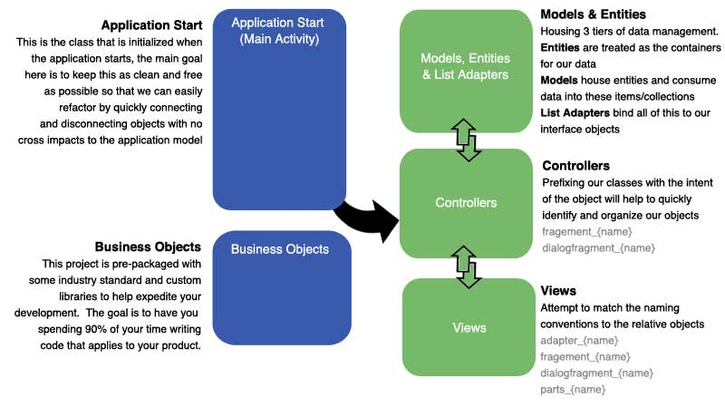

# Android MVC Starter Template

This template was created to help developers who are new to native android development quickly get their projects up and running with minimal effort.  This project serves as 2 things: 1. A learning template  2. An application template that you can use for your own project.

It was designed in such a way that you can go in and view how the sample pages work, each page containing only the code require to perform that specific example so as to reduce the amount of fluff you need to read through.  Once you are comfortable with this then you can move onto turning this into your own project. (Instructions: makingThisYourOwn.txt)  Within minutes you can start coding your own business logic into this app, skipping the hours/days it takes to set everything up that you will need.

<h3>Application Architecture Summary:</h3>

I am referencing this as an Android MVCish type of project because it holds many similarities to the MVC framework.  I know it is not MVC but you can easily make the jump from traditional MVC programming to this model.  One of my goals was to help transition web developers to android development with as little pain as possible.  Face it, at the end of the day these apps consume content from the web apps and api's web developers build.  It goes hand in hand.

<h3>Application Overview:</h3>
I have learned from my own past experiences in android development that you can quickly clutter your application entry point to the point where refactoring becomes virtually unbearable; I wanted to fix that with this project.  I found a great sample of a fragment router that another github project used which would completely solve this issue. (https://github.com/hkusu/android-mvc-sample)

Additionally, I have written a lot of good and bad android code in the past, I have taken what I thought worked well and created some canned classes  for others to use and expand upon in this project for concepts such as JSON Calls and Mapping, Database Functionality, Imaging Functions, etc.  Everything in these libraries are subsets of code I have used and field tested in my other production android applications.

<h4>TO DO:</h4>
I want to expand on my samples by adding the following sample pages:
1. Interfacing with Hardware
2. Interfacing with other software packages (Email, SMS, etc.)
3. Deep Linking Samples
4. Social Media Libraries
5. Google services such as Push Notifications, Analytics, etc.

Once you have a sample of all of these tools (current and future) then I feel you can take this and make practically any business or social media product with ease.  I hope you can take something good from this project; please keep in mind that I 100% understand that there are better ways of doing everything I have done however I have purposely chosen a specific way to demonstrate these concept  because I feel it was a good balance between showing others something new in a way that was easy to understand while not being too far from a good technical practice.

I will also be hosting workshop classes on how to use this product in the future so I will be constantly updating this to make it better and easier to understand over time.